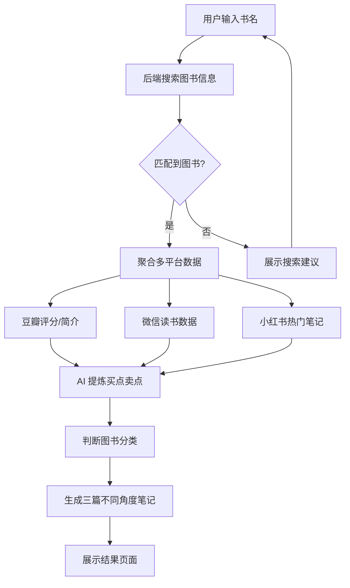

## 1. 产品概述

"图书爆款工坊"是一款面向图书营销人员、出版社编辑、读书博主及自媒体运营者的智能工具。用户只需输入一本书名，系统即可自动聚合豆瓣读书、微信读书、Z-Library 等多个主流平台的图书信息与评分，同时抓取小红书平台上的热门相关笔记，通过 AI 提炼出该书的"买点"（用户为什么买）和"卖点"（营销为什么推），并根据书籍分类自动生成三篇不同角度的小红书爆款笔记文案。

- 核心价值：一站式解决图书营销调研、卖点提炼、内容创作三大痛点，大幅提升图书推广效率
- 目标用户：出版社营销编辑、图书类自媒体博主、知识付费创业者、电商运营人员

## 2. 核心功能

### 2.1 用户角色

| 角色 | 使用方式 | 核心权限 |
|------|----------|----------|
| 普通用户 | 无需注册即可使用 | 图书搜索、信息查看、笔记生成 |

### 2.2 功能模块

1. **图书搜索页**：输入书名，展示搜索结果与匹配建议
2. **图书详情页**：聚合多平台图书信息，展示买点卖点分析
3. **笔记生成页**：展示三篇不同角度的小红书爆款笔记，支持复制

### 2.3 页面详情

| 页面名称 | 模块名称 | 功能描述 |
|----------|----------|----------|
| 搜索主页 | Hero 区域 | 醒目的搜索框，支持输入书名关键词，带自动补全建议 |
| 搜索主页 | 热门推荐 | 展示近期热门图书卡片，点击可快速查看 |
| 搜索主页 | 搜索历史 | 本地存储用户的搜索记录，支持一键清除 |
| 图书详情页 | 图书基本信息 | 展示封面、书名、作者、出版社、出版日期、ISBN |
| 图书详情页 | 平台评分聚合 | 卡片式展示豆瓣评分、微信读书推荐值、各平台评分对比 |
| 图书详情页 | 买点卖点分析 | AI 提炼的核心买点（用户视角痛点）和卖点（营销视角亮点），以标签云和卡片形式呈现 |
| 图书详情页 | 平台链接 | 直达豆瓣、微信读书、Z-Library 等平台的链接按钮 |
| 图书详情页 | 小红书热门笔记 | 展示相关小红书爆款笔记的标题、摘要、互动数据，点击可跳转原文 |
| 笔记生成页 | 角度标签切换 | 三个角度（如"痛点共鸣型""知识干货型""场景种草型"）的Tab切换 |
| 笔记生成页 | 笔记内容展示 | 完整的小红书风格笔记文案，包含标题、正文、标签、配图建议 |
| 笔记生成页 | 一键复制 | 每条笔记支持一键复制到剪贴板 |

## 3. 核心流程

用户输入书名 → 系统搜索并匹配图书 → 展示图书基本信息与多平台评分 → 聚合小红书热门笔记 → AI 分析提炼买点与卖点 → 根据图书分类生成三篇不同角度的小红书爆款笔记 → 用户复制使用

## 4. 用户界面设计

### 4.1 设计风格

- **主色调**：深墨绿（#1B4332）搭配暖金色（#D4A574），营造书店般的沉稳文艺氛围
- **辅助色**：米白（#FAF7F2）作为背景，砖红（#C1666B）作为强调色
- **按钮风格**：微圆角（8px），hover 时轻微上浮阴影效果
- **字体**：标题使用「思源宋体」（Noto Serif SC），正文使用「霞鹜文楷」（LXGW WenKai），营造书香气息
- **布局风格**：卡片式布局，大量留白，模拟翻阅纸质书的节奏感
- **图标风格**：使用 Lucide 图标库，线条细腻，与整体文艺风格统一

### 4.2 页面设计概览

| 页面名称 | 模块名称 | UI 元素 |
|----------|----------|---------|
| 搜索主页 | Hero 区域 | 居中大标题 + 搜索框，背景为渐变墨绿色，配以书本纹理装饰 |
| 搜索主页 | 热门推荐 | 横向滚动的图书卡片，封面图 + 书名 + 评分，hover 时卡片轻微放大 |
| 搜索主页 | 搜索历史 | 底部标签式展示，灰色圆角标签，带删除按钮 |
| 图书详情页 | 图书基本信息 | 左侧大封面图，右侧书名/作者/出版社信息，仿书籍扉页排版 |
| 图书详情页 | 平台评分聚合 | 横向三列卡片，每列显示平台 Logo、评分数字、星级，带进度条 |
| 图书详情页 | 买点卖点分析 | 左侧"买点"面板（用户痛点标签），右侧"卖点"面板（营销亮点标签），中间分割线 |
| 图书详情页 | 小红书热门笔记 | 竖向卡片列表，每条含笔记标题、摘要、点赞/收藏数据，右侧箭头跳转 |
| 笔记生成页 | 角度标签切换 | 三个 Tab 按钮，选中态带下划线动画，对应三种不同颜色标记 |
| 笔记生成页 | 笔记内容展示 | 仿小红书笔记卡片样式，包含标题、正文段落、话题标签、配图建议区 |
| 笔记生成页 | 一键复制 | 每张笔记卡片右上角复制按钮，点击后变勾 + Toast 提示 |

### 4.3 响应式设计

- 桌面端优先设计（1200px+ 为最佳体验），移动端自适应布局
- 移动端：卡片堆叠排列，搜索框全宽，笔记卡片单列展示
- 平板端：两列卡片布局，保留侧边导航

## 5. 数据来源

| 平台 | 数据类型 | 获取方式 |
|------|----------|----------|
| 豆瓣读书 | 评分、简介、作者信息、封面 | 豆瓣 API / 页面解析 |
| 微信读书 | 推荐值、读者评价、阅读数据 | 微信读书 API |
| Z-Library | 图书可用性、下载链接 | Z-Library API |
| 小红书 | 热门笔记标题、摘要、互动数据 | 小红书搜索 API / 页面解析 |
| 当当/京东 | 价格、销量、用户评价 | 页面解析 |