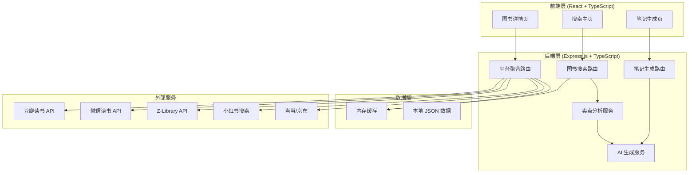
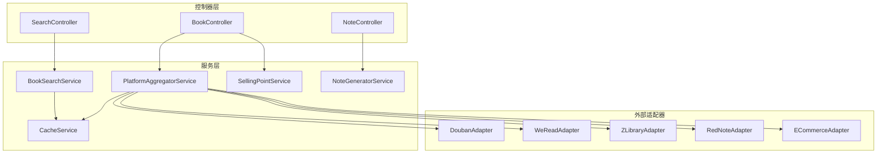
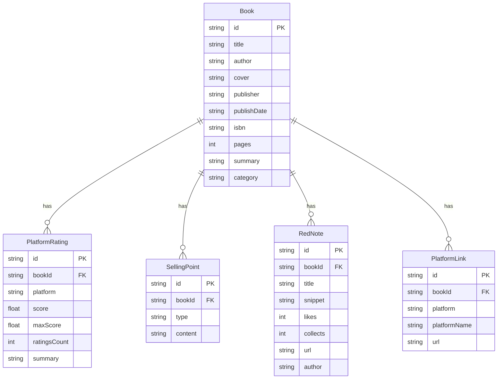

## 1. 架构设计



## 2. 技术选型

- **前端**：React@18 + TypeScript + Tailwind CSS@3 + Vite
- **初始化工具**：vite-init（react-express-ts 模板）
- **后端**：Express@4 + TypeScript
- **状态管理**：Zustand
- **路由**：React Router DOM v6
- **HTTP 客户端**：axios（前端请求后端）、node-fetch（后端请求外部 API）
- **图标**：lucide-react
- **缓存**：node-cache（内存缓存，减少外部 API 调用频率）
- **AI 能力**：通过后端服务调用 AI 模型生成笔记文案

## 3. 路由定义

| 路由 | 页面 | 说明 |
|------|------|------|
| `/` | 搜索主页 | 图书搜索入口，热门推荐，搜索历史 |
| `/book/:id` | 图书详情页 | 展示图书信息、评分、买点卖点、小红书笔记 |
| `/book/:id/notes` | 笔记生成页 | 展示三篇小红书爆款笔记 |

## 4. API 定义

### 4.1 图书搜索

```
GET /api/books/search?q={keyword}&page={page}&limit={limit}
```

**响应示例：**
```typescript
interface SearchResponse {
  success: boolean;
  data: {
    books: BookSummary[];
    total: number;
    page: number;
  };
}

interface BookSummary {
  id: string;
  title: string;
  author: string;
  cover: string;
  publisher: string;
  year: string;
  rating: number;
  source: string; // 数据来源平台
}
```

### 4.2 图书详情聚合

```
GET /api/books/:id
```

**响应示例：**
```typescript
interface BookDetailResponse {
  success: boolean;
  data: {
    basicInfo: BookBasicInfo;
    ratings: PlatformRating[];
    sellingPoints: SellingPoints;
    redNotes: RedNoteSummary[];
    platformLinks: PlatformLink[];
  };
}

interface BookBasicInfo {
  title: string;
  author: string;
  cover: string;
  publisher: string;
  publishDate: string;
  isbn: string;
  pages: number;
  summary: string;
  category: string;
}

interface PlatformRating {
  platform: string;     // "douban" | "weread" | "jd" | "dangdang"
  platformName: string; // "豆瓣读书" | "微信读书" | "京东" | "当当"
  score: number;
  maxScore: number;
  ratingsCount: number;
  summary: string;
}

interface SellingPoints {
  buyPoints: string[];  // 买点：用户为什么买
  sellPoints: string[]; // 卖点：营销为什么推
  painPoints: string[]; // 痛点：用户面临的问题
}

interface RedNoteSummary {
  id: string;
  title: string;
  snippet: string;
  likes: number;
  collects: number;
  url: string;
  author: string;
}

interface PlatformLink {
  platform: string;
  platformName: string;
  url: string;
  icon: string;
}
```

### 4.3 生成小红书笔记

```
POST /api/books/:id/notes
```

**请求体：**
```typescript
interface GenerateNotesRequest {
  category: string;    // 图书分类
  buyPoints: string[];
  sellPoints: string[];
  painPoints: string[];
}
```

**响应示例：**
```typescript
interface GenerateNotesResponse {
  success: boolean;
  data: {
    notes: GeneratedNote[];
  };
}

interface GeneratedNote {
  id: string;
  angle: string;        // 角度名称，如 "痛点共鸣型"
  angleLabel: string;   // 角度标签
  title: string;        // 笔记标题
  content: string;      // 笔记正文
  hashtags: string[];   // 话题标签
  imageSuggestions: string[]; // 配图建议
}
```

## 5. 服务架构



## 6. 数据模型

### 6.1 数据模型定义



### 6.2 初始数据

系统内置热门图书种子数据，涵盖文学、商业、心理、科普等主流分类，确保首次使用即有可展示内容。外部平台数据通过 API 实时获取，本地缓存 1 小时。

## 7. 非功能性需求

- **性能**：搜索结果响应时间 < 2s，详情页加载 < 3s
- **缓存策略**：外部 API 数据缓存 1 小时，减少重复请求
- **降级方案**：外部平台 API 不可用时，展示本地种子数据 + 提示信息
- **安全**：后端做请求频率限制，防止滥用